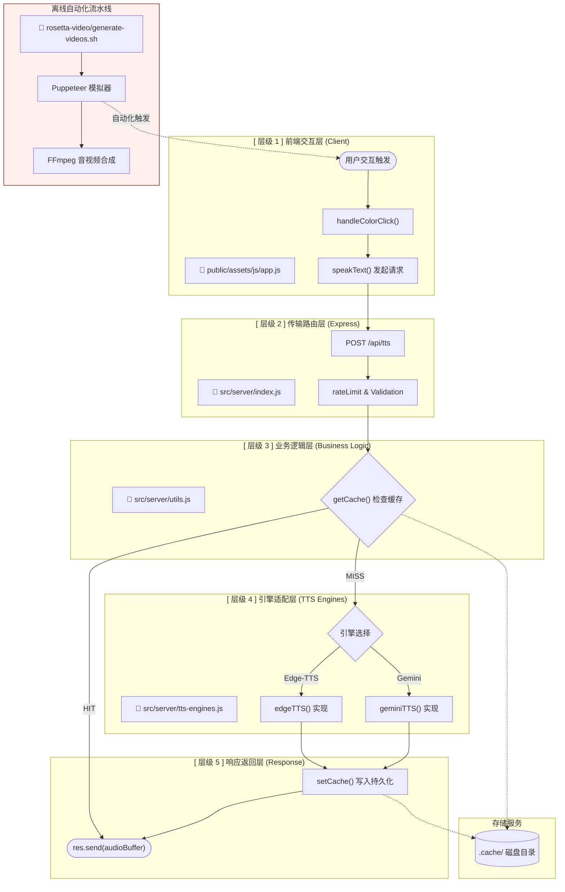

# Color Rosetta 核心架构与执行链路

本文档通过稳健的垂直分层视图展示 **Color Rosetta** 的系统架构与核心执行逻辑。

## 1. 稳健型架构执行图 (Robust Architecture Flow)

---

## 2. 核心架构组件说明

### 2.1 表现层 (Presentation Layer)
- **文件**: `public/assets/js/app.js`
- **核心逻辑**: 负责原生 DOM/SVG 色轮渲染与用户点击事件捕获。
- **状态管理**: 维护 `audioCache` 内存缓存，确保同一会话内重复点击可直接复用已下载音频。

### 2.2 传输与安全层 (Transport & Security Layer)
- **文件**: `src/server/index.js`
- **核心逻辑**: Express 路由分发。
- **安全机制**: 实施 IP 级别的 `rateLimit` 以及严格的 `VALID_LANGS` 白名单校验。

### 2.3 业务逻辑层 (Business Logic Layer)
- **文件**: `src/server/utils.js`
- **核心逻辑**: 
  - **MD5 键值生成**: 确保相同文本在不同引擎/语言下有唯一的缓存 ID。
  - **缓存透明化**: 对上层业务隐藏文件系统读写细节。

### 2.4 引擎适配层 (Engine Adapter Layer)
- **文件**: `src/server/tts-engines.js`
- **核心逻辑**:
  - 适配 Edge-TTS 与 Gemini TTS 接口。
  - **失败回退**: Edge-TTS 在特定错误场景下可切换到 7897 代理端口重试。

### 2.5 视频自动化流水线 (Off-line Pipeline)
- **核心逻辑**: 
  - 使用 Puppeteer 驱动 Headless Chromium。
  - 通过 FFmpeg 执行高性能的音视频流合并。

---

## 3. 技术栈总结

| 维度 | 技术选型 |
| :--- | :--- |
| **前端渲染** | Vanilla JS, SVG, CSS Variables |
| **后端运行时** | Node.js (ES Modules) |
| **Web 框架** | Express.js |
| **TTS 引擎** | Microsoft Edge-TTS, Google Gemini |
| **自动化录制** | Puppeteer, FFmpeg |
| **存储策略** | 文件系统级 MD5 缓存 |
